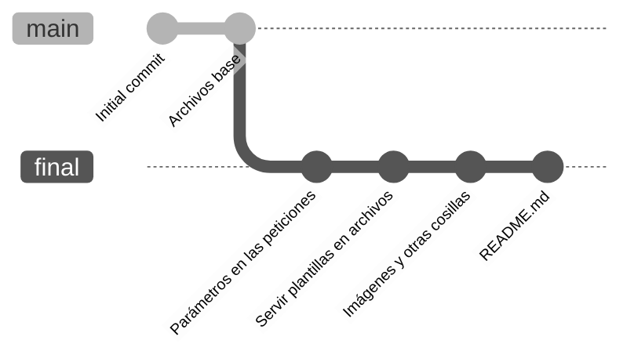

https://github.com/appuchias/bases_web

---

## Configuración de git
> `git config --global user.name NOMBRE`
> `git config --global user.email EMAIL`

---
## Configuración de git
Pero también se pueden hacer cambios para un solo repo (útil para usar el mail de la UDC en el repo de RI pero no para los demás):
> `git config user.name`
> `git config user.email`

---
## Git aliases
> `git config --global --get-regexp alias`

> `git config --global alias.<NOMBRE DEL ALIAS> "<SUBCOMANDO DE GIT>"`

---
## Git stash?
Guarda toda la diferencia entre el estado actual de tus archivos y la última versión guardada en el repo (último commit normalmente).

> `git stash [push] [-S]`
> `git stash pop`
> `git stash drop`

---
## Entornos virtuales
venv -> virtualenv (-> pipenv)?

> `python -m venv env`
> `python -m virtualenv env`

---
## `requirements.txt`
Paquetes necesarios con versiones

---
## Pipenv
> `python -m pip install pipenv`
> `[python -m] pipenv install [paquetes]`

Guarda la lista de paquetes instalados en:
> Pipfile
> Pipfile.lock

---
## Pipenv (2)
Compatible con `requirements.txt`:
> `pipenv requirements`

---
## Frontend / backend

Sitios estáticos / dinámicos

---
## Index.html

Páginas simples

---
## Puertos, IPs y esas cosas (espero que os acordeis de IRD)

Máscara de subred -> C.P.
[Códigos postales](https://es.wikipedia.org/wiki/Anexo:Provincias_de_Espa%C3%B1a_por_c%C3%B3digo_postal)

---
## Python `http.server`

Problemas de seguridad

---
## Flask

> `flask run [--debug]`

https://flask.palletsprojects.com/en/stable/#api-reference

---
## Hosting y dominios

GH Pages
VPS

---
## Breve intro a Django

Separar info en archivos
"Aplicaciones"
Página de admin

---
## Hugo? (Muy por encima, sobre todo MD -> html)

Blogs y generadores de páginas estáticas

---
## DOCKER

MERECE LA PENA POR FAVOR

Arrancar bases de datos en local sin instalar un programa enorme en el PC

Desventaja: terminal
Solución: Docker desktop (no me gusta pero no está mal)

---
## Deepseek R1 en local

Usando ollama puedes descargar el modelo y ejecutarlo en local

https://ollama.com/download

https://ollama.com/library/deepseek-r1

---
# Info
Diapositivas hechas en Obsidian.md con el plugin "slides".

MD disponible en el repo.
